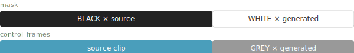
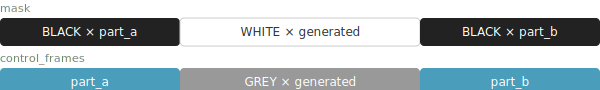
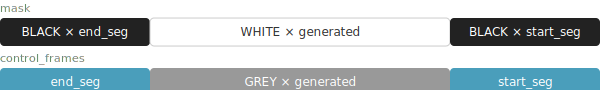
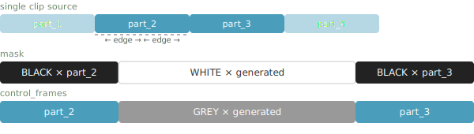
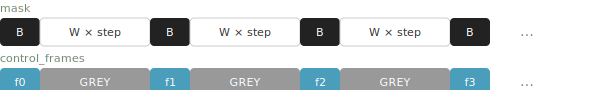
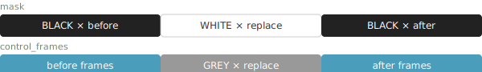
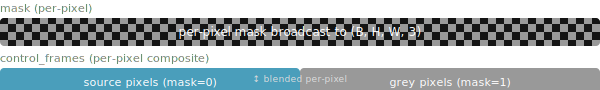
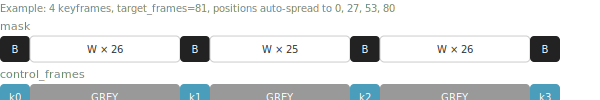
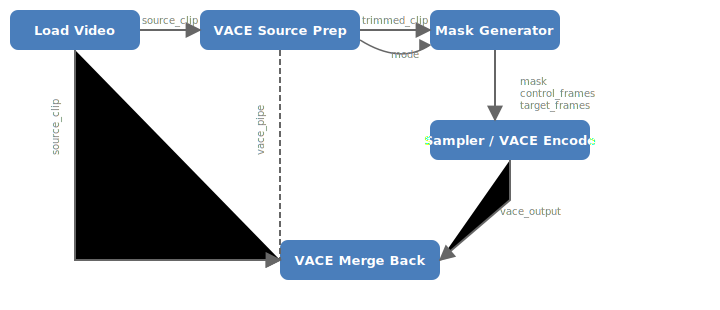

# ComfyUI-VACE-Tools

ComfyUI custom nodes for WanVideo/VACE workflows — mask/control-frame generation and model saving.

## Installation

```bash
cd ComfyUI/custom_nodes/
git clone https://github.com/ethanfel/Comfyui-VACE-Tools.git
```

Restart ComfyUI. Nodes appear under the **VACE Tools** and **WanVideoWrapper** categories.

## Node: VACE Source Prep

Trims long source clips so they can be used with VACE Mask Generator. Place this node **before** the mask generator when your source clip has more frames than `target_frames`. It selects the relevant frames based on mode and outputs adjusted parameters to wire directly into the mask generator.

Irrelevant widgets are automatically hidden based on the selected mode.

### Inputs

| Input | Type | Default | Description |
|---|---|---|---|
| `source_clip` | IMAGE | — | Full source video frames (B, H, W, C tensor). |
| `mode` | ENUM | `End Extend` | Generation mode — must match the mask generator's mode. |
| `split_index` | INT | `0` | Split position in the full source video (0 = auto-middle for Middle Extend). Same meaning as the mask generator's split_index. |
| `input_left` | INT | `0` | Frames from the left side of the split point to keep (0 = all available). End: trailing context. Middle: frames before split. Edge/Join: start edge size. Bidirectional: trailing context. Replace: context before region. |
| `input_right` | INT | `0` | Frames from the right side of the split point to keep (0 = all available). Pre: leading reference. Middle: frames after split. Edge/Join: end edge size. Replace: context after region. |
| `edge_frames` | INT | `8` | Default edge size for Edge/Join modes (overridden by input_left/input_right if non-zero). Replace/Inpaint: number of frames to replace. |
| `source_clip_2` | IMAGE | *(optional)* | Second clip for Join Extend — join two separate clips instead of splitting one in half. |
| `inpaint_mask` | MASK | *(optional)* | Spatial inpaint mask — trimmed to match output frames for Video Inpaint mode. |
| `keyframe_positions` | STRING | *(optional)* | Keyframe positions pass-through for Keyframe mode. |

### Outputs

| Output | Type | Description |
|---|---|---|
| `trimmed_clip` | IMAGE | Trimmed frames — wire to mask generator's source_clip. |
| `mode` | ENUM | Selected mode — wire to mask generator's mode. |
| `split_index` | INT | Adjusted for the trimmed clip — wire to mask generator. |
| `edge_frames` | INT | Adjusted/passed through — wire to mask generator. |
| `inpaint_mask` | MASK | Trimmed to match output, or placeholder. |
| `keyframe_positions` | STRING | Pass-through. |
| `vace_pipe` | VACE_PIPE | Pipe carrying mode, trim bounds, and context frame counts — wire to VACE Merge Back. |

### Per-Mode Trimming

| Mode | input_left | input_right | Behavior |
|---|---|---|---|
| End Extend | Trailing context frames | — | Keeps last N frames |
| Pre Extend | — | Leading reference frames | Keeps first N frames |
| Middle Extend | Frames before split | Frames after split | Window around split_index |
| Edge Extend | Start edge size | End edge size | Overrides edge_frames; forced symmetric (min of both) |
| Join Extend | Edge from first half/clip | Edge from second half/clip | Edge context around midpoint (or between two clips if source_clip_2 connected); forced symmetric |
| Bidirectional | Trailing context frames | — | Keeps last N frames |
| Frame Interpolation | — | — | Pass-through (no trimming) |
| Replace/Inpaint | Context before region | Context after region | Window around replace region |
| Video Inpaint | — | — | Pass-through (no trimming) |
| Keyframe | — | — | Pass-through (no trimming) |

---

## Node: VACE Mask Generator

Builds mask and control_frames sequences for all VACE generation modes. Works standalone for short clips, or downstream of VACE Source Prep for long clips.

**Note:** For modes that use `target_frames` (End, Pre, Middle, Edge, Join, Bidirectional, Keyframe), `source_clip` must not have more frames than `target_frames`. If your source is longer, use VACE Source Prep upstream to trim it first.

### Inputs

| Input | Type | Default | Description |
|---|---|---|---|
| `source_clip` | IMAGE | — | Source video frames (B, H, W, C tensor). Must not exceed target_frames for modes that use it. |
| `mode` | ENUM | `End Extend` | Generation mode (see below). 10 modes available. |
| `target_frames` | INT | `81` | Total output frame count for mask and control_frames (1–10000). Used by Keyframe to set output length. Unused by Frame Interpolation, Replace/Inpaint, and Video Inpaint. |
| `split_index` | INT | `0` | Where to split the source. Middle: split frame index (0 = auto-middle). Bidirectional: frames before clip (0 = even split). Frame Interpolation: new frames per gap. Replace/Inpaint: start index of replace region. Unused by End/Pre/Edge/Join/Video Inpaint/Keyframe. Raises an error if out of range. |
| `edge_frames` | INT | `8` | Number of edge frames for Edge and Join modes. Replace/Inpaint: number of frames to replace. Unused by End/Pre/Middle/Bidirectional/Frame Interpolation/Video Inpaint/Keyframe. |
| `inpaint_mask` | MASK | *(optional)* | Spatial inpaint mask for Video Inpaint mode (B, H, W). White (1.0) = regenerate, Black (0.0) = keep. Single frame broadcasts to all source frames. |
| `keyframe_positions` | STRING | *(optional)* | Comma-separated frame indices for Keyframe mode (e.g. `0,20,50,80`). One position per source frame, sorted ascending, within [0, target_frames-1]. Leave empty for even auto-spread. |

### Outputs

| Output | Description |
|---|---|
| `control_frames` | Source frames composited with grey (`#7f7f7f`) fill. Fed to VACE as visual reference. |
| `mask` | Black/white frame sequence. Black = keep, White = generate. |
| `target_frames` | INT — total frame count of the output sequence, snapped to 4n+1 (1, 5, 9, …, 81, …). Wire directly to VACE encode. |

## Mode Reference

---

### End Extend

Generate new frames **after** the source clip.

- **`split_index`** — optional trim: `0` keeps the full clip; a negative value (e.g. `-16`) drops that many frames from the end before extending.



---

### Pre Extend

Generate new frames **before** a reference portion of the source clip.

- **`split_index`** — how many frames from the start to keep as the reference tail (e.g. `24`).


---

### Middle Extend

Generate new frames **between** two halves of the source clip, split at `split_index`.

- **`split_index`** — frame index where the source is split (`0` = auto-middle). Raises an error if out of range.



---

### Edge Extend

Generate a transition **between the end and start** of a clip (useful for looping).

- **`edge_frames`** — number of frames taken from each edge.
- **`split_index`** — unused.

The end segment is placed first, then the generated gap, then the start segment — so the model learns to connect the clip's end back to its beginning.



---

### Join Extend

Heal/blend **two halves** of a clip (or two separate clips) together. By default, the source is split in half; `edge_frames` from each side of the split form the context. If `source_clip_2` is connected (via VACE Source Prep), the two clips are joined directly instead.

- **`edge_frames`** — context frames taken from each side of the join point.
- **`split_index`** — unused.



---

### Bidirectional Extend

Generate new frames **both before and after** the source clip.

- **`split_index`** — number of generated frames to place before the clip. `0` = even split (half before, half after).
- **`target_frames`** — total output frame count.


---

### Frame Interpolation

Insert generated frames **between each consecutive pair** of source frames.

- **`split_index`** — number of new frames to insert per gap (min 1). `target_frames` is unused.



---

### Replace/Inpaint

Regenerate a range of frames **in-place** within the source clip.

- **`split_index`** — start index of the region to replace. Raises an error if out of range.
- **`edge_frames`** — number of frames to replace (clamped to remaining frames after start).
- `target_frames` is unused. Total output = `source_frames` (in-place replacement).



---

### Video Inpaint

Regenerate **spatial regions** within frames using a per-pixel mask. Unlike other modes that work at the frame level (entire frames kept or generated), Video Inpaint operates at the pixel level — masked regions are regenerated while the rest of each frame is preserved.

- **`inpaint_mask`** *(required)* — a `MASK` (B, H, W) where white (1.0) marks regions to regenerate and black (0.0) marks regions to keep. A single-frame mask is automatically broadcast to all source frames; a multi-frame mask must have the same frame count as `source_clip`.
- **`target_frames`**, **`split_index`**, **`edge_frames`** — unused.
- Total output = `source_frames` (same length — in-place spatial replacement).

Compositing formula per pixel:

```
control_frames = source × (1 − mask) + grey × mask
```



---

### Keyframe

Place keyframe images at specific positions within a `target_frames`-length output, and generate everything between them.

- **`source_clip`** — a small batch of keyframe images (e.g. 4 frames).
- **`target_frames`** — total output frame count.
- **`keyframe_positions`** *(optional)* — comma-separated frame indices (e.g. `"0,20,50,80"`). Must have one value per source frame, sorted ascending, no duplicates, all within [0, target_frames-1]. Leave empty for **auto-spread** (first keyframe at frame 0, last at `target_frames-1`, others evenly distributed).
- **`split_index`**, **`edge_frames`** — unused.



---

## Node: VACE Merge Back

Splices VACE sampler output back into the original full-length video. Connect the original (untrimmed) clip, the VACE sampler output, and the `vace_pipe` from VACE Source Prep. The pipe carries mode, trim bounds, and context frame counts for automatic blending.

Irrelevant widgets are automatically hidden based on the selected blend method.

### Inputs

| Input | Type | Default | Description |
|---|---|---|---|
| `source_clip` | IMAGE | — | Full original video (before any trimming). Same source as VACE Source Prep's source_clip. |
| `vace_output` | IMAGE | — | VACE sampler output. |
| `vace_pipe` | VACE_PIPE | — | Pipe from VACE Source Prep carrying mode, trim bounds, and context counts. |
| `blend_method` | ENUM | `optical_flow` | `none` (hard cut), `alpha` (linear crossfade), or `optical_flow` (motion-compensated). |
| `of_preset` | ENUM | `balanced` | Optical flow quality: `fast`, `balanced`, `quality`, `max`. |
| `source_clip_2` | IMAGE | *(optional)* | Second original clip for Join Extend with two separate clips. |

### Outputs

| Output | Type | Description |
|---|---|---|
| `merged_clip` | IMAGE | Full reconstructed video. |

### Behavior

**Pass-through modes** (Edge Extend, Frame Interpolation, Keyframe, Video Inpaint): returns `vace_output` as-is — the VACE output IS the final result for these modes.

**Splice modes** (End, Pre, Middle, Join, Bidirectional, Replace): reconstructs `source_clip[:trim_start] + vace_output + source_clip[trim_end:]`, then blends across the full context zones at each seam. For two-clip Join Extend, the tail comes from `source_clip_2` instead.

Context frame counts (`left_ctx`, `right_ctx`) are carried in the `vace_pipe` and determined automatically by VACE Source Prep based on the mode and input_left/input_right settings. Blending uses a smooth alpha ramp across the entire context zone. Optical flow blending warps both frames along the motion field before blending, reducing ghosting on moving subjects.

### Example: Middle Extend

```
Original:  274 frames (0–273)
Prep:      split_index=137, input_left=16, input_right=16
           → vace_pipe: trim_start=121, trim_end=153, left_ctx=16, right_ctx=16
Mask Gen:  target_frames=81
           → mask = [BLACK×16] [WHITE×49] [BLACK×16]
VACE out:  81 frames (from sampler)
Merge:     result = original[0:121] + vace[0:81] + original[153:274]
           → 121 + 81 + 121 = 323 frames
           Left blend:  vace[0..15] ↔ original[121..136] (full 16-frame context zone)
           Right blend: vace[65..80] ↔ original[137..152] (full 16-frame context zone)
```

### Wiring Diagram



---

## Node: WanVideo Save Merged Model

Saves a WanVideo diffusion model (with merged LoRAs) as a `.safetensors` file. Found under the **WanVideoWrapper** category.

### Inputs

| Input | Type | Default | Description |
|---|---|---|---|
| `model` | WANVIDEOMODEL | — | WanVideo model with merged LoRA from the WanVideo Model Loader. |
| `filename_prefix` | STRING | `merged_wanvideo` | Filename prefix for the saved file. A numeric suffix is appended to avoid overwriting. |
| `save_dtype` | ENUM | `same` | Cast weights before saving: `same`, `bf16`, `fp16`, or `fp32`. Set explicitly if the model was loaded in fp8. |
| `custom_path` | STRING | *(optional)* | Absolute path to save directory. Leave empty to save in `ComfyUI/models/diffusion_models/`. |

### Behavior

- Extracts the diffusion model state dict and saves it in safetensors format.
- Records source model name and merged LoRA details (names + strengths) in file metadata for traceability.
- Clones all tensors before saving to handle shared/aliased weights safely.
- Automatically avoids overwriting existing files by appending `_1`, `_2`, etc.

---

## Node: Save Latent (Absolute Path)

Saves a LATENT to an absolute file path as `.latent` (safetensors format). Found under the **latent** category.

### Inputs

| Input | Type | Default | Description |
|---|---|---|---|
| `samples` | LATENT | — | Latent samples to save. |
| `path` | STRING | `/path/to/latent.latent` | Absolute file path. `.latent` extension is appended if missing. |
| `overwrite` | BOOLEAN | `False` | If false, appends `_1`, `_2`, etc. to avoid overwriting. |

### Outputs

| Output | Description |
|---|---|
| `LATENT` | Pass-through of the input samples (for chaining). |

### Behavior

- Saves all tensor data via safetensors, with device info and non-tensor metadata stored in the file header.
- Creates parent directories automatically.

---

## Node: Load Latent (Absolute Path)

Loads a LATENT from an absolute file path. Found under the **latent** category.

### Inputs

| Input | Type | Default | Description |
|---|---|---|---|
| `path` | STRING | `/path/to/latent.latent` | Absolute path to a `.latent` file previously saved by Save Latent. |

### Outputs

| Output | Description |
|---|---|
| `LATENT` | Restored latent samples with original devices and non-tensor data. |

## Dependencies

- **PyTorch** and **safetensors** — bundled with ComfyUI.
- **OpenCV** (`cv2`) — optional, for optical flow blending in VACE Merge Back. Falls back to alpha blending if unavailable.
